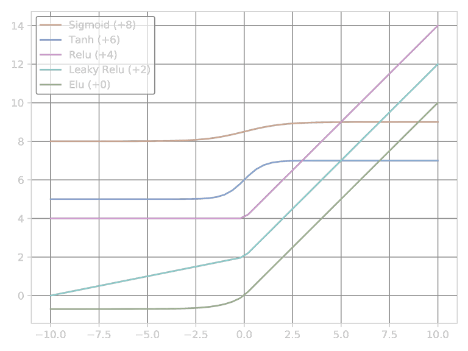

## Activate

将非线性特性引入到我们的网络中。

```py
import matplotlib.pyplot as plt
import numpy as np

x = np.linspace(-10, 10)
y_sigmoid = 1 / (1 + np.exp(-x))
y_tanh = (np.exp(x) - np.exp(-x)) / (np.exp(x) + np.exp(-x))
y_relu = np.array([0 if item < 0 else item for item in x])
alpha_relu = 0.2
y_leaky_relu = np.array([alpha_relu * item if item < 0 else item for item in x])
alpha_elu = 0.7
y_elu = np.array([alpha_elu*(np.exp(item)-1) if item < 0 else item for item in x])

plt.figure(dpi=600)

plt.plot(x, 8+y_sigmoid, label='Sigmoid (+8)')
plt.plot(x, 6+y_tanh, label='Tanh (+6)')
plt.plot(x, 4+y_relu, label='Relu (+4)')
plt.plot(x, 2+y_leaky_relu, label='Leaky Relu (+2)')
plt.plot(x, 0+y_elu, label='Elu (+0)')

plt.grid()
plt.legend()
plt.show()
```



### Sigmoid

$$f(x) = \dfrac{1}{1 + e^{-x}}$$

```py
tf.nn.sigmoid(x)
```

### Tanh

$$f(x) = \dfrac{e^{x} - e^{-x}}{e^{x} + e^{-x}}$$

```py
tf.nn.tanh(x)
```

### ReLU

$$f(x) = \max(0, x)$$

```py
tf.nn.relu(x)
```

### Leaky ReLU

$$f(x) = \begin{cases}
    x   & x≥0
\\  αx  & x<0
\end{cases}$$

```py
tf.nn.leaky_relu(x, alpha=0.2)
```

### ELU

$$f(x) = \begin{cases}
    x           & x≥0
\\  α(e^x-1)    & x<0
\end{cases}$$

- $α$：ELU负值部分在何时饱和。

```py
tf.nn.elu(x, alpha=0.2)
```

### Softmax

把一个序列，变成概率。Softmax是一种非常明显的**马太效应**（强的更强，弱的更弱）。但是这种方法非常的不稳定。因为要算指数，只要输入稍微大一点，则在计算上一定会溢出。

$$\mathrm{Softmax}\left(
    \left[\begin{array}{c} a_1 \\ a_2 \\ \vdots \\ a_n \end{array}\right]
\right) =\left[\begin{array}{c}
    \dfrac{e^{a_1}}{\sum_{i=1}^{n}e^{a_i}}
&   \dfrac{e^{a_2}}{\sum_{i=1}^{n}e^{a_i}}
&   \cdots
&   \dfrac{e^{a_n}}{\sum_{i=1}^{n}e^{a_i}}
\end{array}\right]^T$$

```py
def softmax(x):
    exps = np.exp(x)
    return exps / np.sum(exps)
```

```py
tf.nn.softmax(logits)
```

#### Softmax变体

```py
def stablesoftmax(x):
    shiftx = x - np.max(x)
    exps = np.exp(shiftx)
    return exps / np.sum(exps)
```
