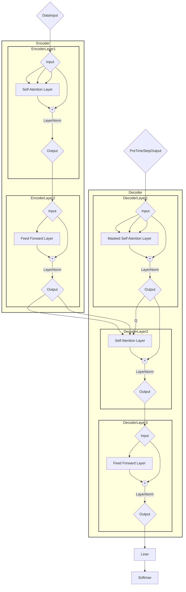
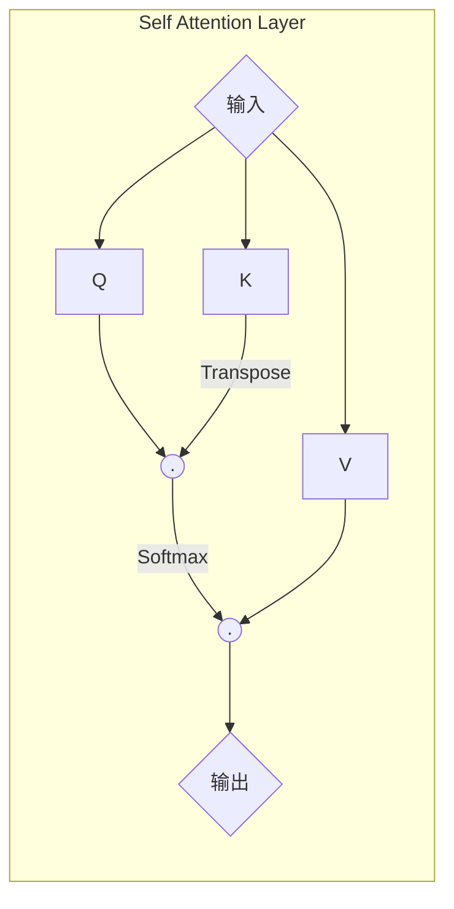

# [Attention is all you need](./index.html)

## Architecture



## Base

### BatchNorm

pass

### LayerNorm

$$Norm(x) = w \dfrac{x - Mean(x)}{Std(x) + eps} + b$$

```python
import torch


class LayerNorm(torch.nn.Module):
    """
    Construct a layernorm module.
    https://arxiv.org/abs/1607.06450
    """
    def __init__(self, features, eps=1e-6):
        super(LayerNorm, self).__init__()
        # Parameter: A kind of Tensor that is to be considered a module parameter.
        self.w = torch.nn.Parameter(torch.ones(features))
        self.b = torch.nn.Parameter(torch.zeros(features))
        self.eps = eps

    def forward(self, x):
        # calculate by dimension.
        mean = x.mean(-1, keepdim=True)
        std = x.std(-1, keepdim=True)
        return self.w * (x - mean) / (std + self.eps) + self.b

```

## Mask

This masking, combined with fact that the output embeddings are offset by one position, ensures that the predictions for position $i$ can depend only on the known outputs at positions less than $i$.

```python
def subsequent_mask(size):
    """Mask out subsequent positions."""
    import numpy as np
    from torch import from_numpy
    mask = np.triu(np.ones((1, size, size), dtype=np.uint8), k=1) == 0
    return from_numpy(mask)


if __name__ == '__main__':
    import matplotlib.pyplot as plt
    print("Black: F")
    print("White: T")
    plt.figure(figsize=(5, 5))
    plt.imshow(subsequent_mask(20)[0], cmap=plt.cm.gray)
    plt.grid()
    plt.show()

```

## Core

### Self-Attention



$$\mathrm{Attention}(Q, K, V) = \mathrm{Softmax}(\frac{QK^T}{\sqrt{d_k}})V$$

- $d$ is the dimension of  $Q$ and $K$.

```python
def attention(q, k, v, mask=None, dropout=None):
    """
    Compute 'Scaled Dot Product Attention'
    :param q: query
    :param k: key
    :param v: value
    :param mask:
    :param dropout:
    :return:
    """
    from math import sqrt
    from torch import matmul
    from torch.nn.functional import softmax

    d_k = q.size(-1)
    k_t = k.transpose(-2, -1)
    scores = matmul(q, k_t) / sqrt(d_k)
    if mask is not None:
        scores = scores.masked_fill(mask == 0, -1e9)

    scores_head = softmax(scores, dim=-1)
    if dropout is not None:
        scores_head = dropout(scores_head)
    output = matmul(scores_head, v)

    return output, scores

```

### Feed-Forward

pass
