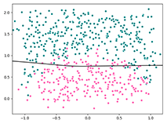
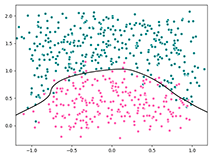
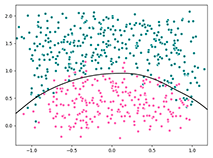
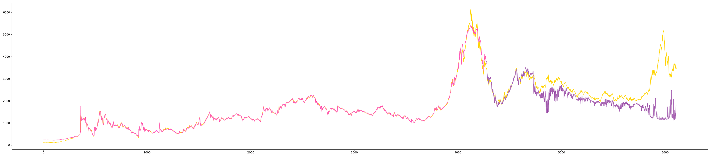

## Demonstrate

### Hello

>[`demo-Hello.py`](./demo-Hello.py)

```flow
st=>start: 开始
datasets=>inputoutput: 导入数据
networks=>operation: 定义神经网络
loss=>operation: 定义损失函数
optimizer=>operation: 定义优化器
training=>operation: 训练
ed=>end: 结束

st->datasets->networks->loss->optimizer->training->ed
```

### Learning Rate

>[`demo-LearningRate.py`](./demo-LearningRate.py)

学习率既不能过大，也不能过小。 过小：训练速度慢；过大：可能导致模型震荡。

**指数衰减法**则可很好的解决上述问题

```py
"""
learning_rate = initial_learning_rate * decay_rate ^ (global_step / decay_steps)
    learning_rate        : 每轮实际使用的学习率
    initial_learning_rate: 初始学习率
    global_step          : tf.Variable(0, trainable=False)
    decay_steps          : 衰减速度
    decay_rate           : 衰减系数
    staircase            : 是否以离散间隔衰减学习速率

global_step为固定写法，用以记录训练次数
staircase为真时(global_step / decay_steps)的值会被转化为整数
"""
decayed_learning_rate = tf.train.exponential_decay(
    initial_learning_rate,
    global_step,
    decay_steps,
    decay_rate,
    staircase=False
)
```

### Fitting

>[`demo-Fitting.py`](./demo-Fitting.py)

使用正则化避免过拟合。

```py
from tensorflow.contrib.layers import l2_regularizer

# 定义正则化方法，设置正则化力度
l2_regularizer = l2_regularizer(REGULARIZATION_RATE)

# 收集每个权重的信息
tf.add_to_collection('losses', l2_regularizer(weights))

# 在原损失函数的基础上构建正则化损失函数
loss_l2 = tf.add_n(tf.get_collection('losses')) + loss

# 使用正则化后的损失函数作为下降方向
train_op = tf.train.AdamOptimizer(LEARNING_RATE).minimize(loss_l2)
```

#### 欠拟合



#### 过拟合



#### 拟合（L2正则化）



### Moving

>[`demo-Moving.py`](./demo-Moving.py)

滑动平均模型用来估计变量的局部均值，使得变量的更新与一段时间内的历史取值有关。
在采用随机梯度下降算法训练神经网络时，使用滑动平均模型可以在一定程度提高最终模型在测试数据上的表现。

该模型会维护一个影子变量（shadow variable），这个影子变量的初始值就是相应变量的初始值，每次运行时，会对影子变量的值进行更新。

```py
# 先生成一般网络
y = activation(tf.matmul(x, weight) + biases)

"""
shadow_variable = decay * shadow_variable + (1 - decay) * variable
    decay:                  衰减率，决定更新速度（一般为0.999或0.9999）
    shadow_variable:        影子变量
    variable:               待更新的变量
"""
ema = tf.train.ExponentialMovingAverage(decay=衰减率, num_updates=None)
    # num_updates(optional):  动态设置decay大小
    # decay = min(decay, (1+num_updates)/(10+num_updates))

# 需要同时训练ema_op
ema_op = ema.apply(tf.trainable_variables())

# 再生成EMA网络
y = activation(tf.matmul(x, ema.average(weight)) + ema.average(biases))

# 定义优化器
train_op = tf.train.Optimizer(learning_rate).minimize(loss)
train_ops = [train_op, ema_op]
```

### Restore

>[`demo-Restore.py`](./demo-Restore.py)

模型保存与复用。

```py
# Saver必须在定义完网络之后才能实例化
saver = tf.train.Saver()

with tf.Session() as sess:
    # ...
    print("Trained")
    saver.save(sess, model_location)
```

### TensorBoard

>[`demo-TensorBoard.py`](./demo-TensorBoard.py)

可视化预览模型。

### Convolutional Neural Networks

>[`demo-CNN.py`](./demo-CNN.py)

能够按其阶层结构对输入信息进行平移不变分类。用于解决，因为图像数据量大导致的处理效率低；和图像在数字化的过程中难以保留的特征的问题。

### Recurrent Neural Network

>[`demo-LSTM.py`](./demo-LSTM.py)

```py
import tensorflow as tf
from tensorflow.python.ops.rnn_cell_impl import BasicRNNCell
# from tensorflow.python.ops.rnn_cell_impl import BasicLSTMCell

#...

# Cell
generate_one_cell = (lambda: BasicRNNCell(rnn_unit))
cell = tf.nn.rnn_cell.MultiRNNCell([generate_one_cell() for i in range(rnn_deep)])
init_state = cell.zero_state(batch_size, dtype=tf.float32)

# 建立网络
input_reshaped = tf.reshape(input_tensor, [-1, input_size])
input_weighted = tf.matmul(input_reshaped, weights_input) + biases_input
rnn_input = tf.reshape(input_weighted, [-1, time_step, rnn_unit])
rnn_output, final_states = tf.nn.dynamic_rnn(cell, rnn_input, initial_state=init_state, dtype=tf.float32)

y_pred = tf.matmul(
    tf.reshape(rnn_output, [-1, rnn_unit]),
    weights_output
) + biases_output
```

**运行效果**


